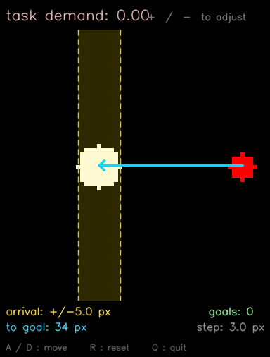
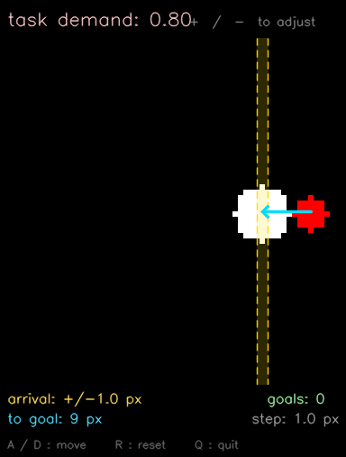

# goal-tracking-env

a minimal 1D cursor-to-goal tracking environment for studying control strategies under varying task demands.

**[project page](https://almalago.github.io/control-arbitration/)**

| prospective (td = 0.0) | reactive (td = 0.8) |
|:---:|:---:|
|  |  |

at low demand the agent plans a long smooth approach. at high demand it corrects continuously toward a nearby but narrow target.

---

## motivation

humans and animals switch between prospective control (plan at the level of events) and reactive control (constant sensory feedback) based on task demands. reaching for a bottle uses prediction; threading a needle requires continuous monitoring. this environment provides a minimal testbed for studying when agents switch strategies.

## install

```bash
git clone https://github.com/almalago/goal-tracking-env
cd goal-tracking-env
pip install -e .
```

## usage

```python
from goal_tracking_env import GoalTrackingEnv

env = GoalTrackingEnv(task_demand=0.5)
obs, info = env.reset()

for _ in range(100):
    action = env.oracle_action()          # or your own policy
    obs, reward, terminated, truncated, info = env.step(action)
    if terminated:
        obs, info = env.reset()
```

## task demand

`task_demand ∈ [0, 1]` jointly controls reset distance and arrival tolerance:

| demand | reset distance | tolerance | regime |
|--------|---------------|-----------|--------|
| 0.0    | 28 px (max)   | 5 px      | prospective  |
| 0.5    | 14 px         | 2.5 px    | intermediate |
| 0.88   | 3 px          | 0.6 px    | reactive     |

higher demand → shorter reach, tighter arrival, smaller steps.

## interactive demo

```bash
python interactive.py
```

controls: `A`/`D` move cursor · `+`/`-` adjust demand · `R` reset · `Q` quit

## citation

```bibtex
@misc{lago2026mechanistic,
      title={Mechanistic Foundations of Goal-Directed Control},
      author={Alma Lago},
      year={2026},
      eprint={2603.15248},
      archivePrefix={arXiv},
      primaryClass={cs.LG},
      url={https://arxiv.org/abs/2603.15248},
}
```
